# fish_life
Database insertion script for all genomic data related to the NSF-funded fish-life project.

## Prerequisites
- You need to install [sequelpro](https://sequelpro.com/download), a fast, easy-to-use Mac database management application for working with MySQL databases.  You can, however, use any MySQL DB management application to work with the database, but the instructions detailed below **only applies to sequelpro**.  
- You need to get the [connection details](https://sequelpro.com/docs/get-started/get-connected/remote) for the remote MySQL server that is, presumably hosted in a cloud service provider (e.g. [AWS](https://aws.amazon.com/), [Azure](https://azure.microsoft.com/en-us/overview/what-is-azure/), [Google App Engine](https://cloud.google.com/appengine/)).

## Database setup instructions
1. Open sequelpro.
2. Enter your connection details in the form below.
    - **NOTE: YOU SHOULD NOT CHANGE THE PORT AS PORT `3306` IS THE DEFAULT PORT FOR MySQL DBs**
    - Here is an example: 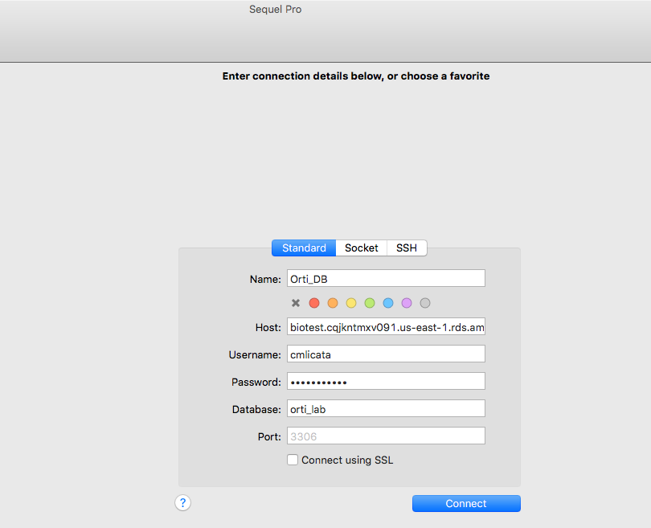
3. Click "Add to Favorites" to save the connection for use next time you open Sequel Pro. Passwords are stored in the Keychain. To re-order favorites click the pencil in the bottom left of the connection window, (or choose Preferences > Favorites from the Sequel Pro menu) then drag the favorites in the list.
4. Execute the `fish_data_create_tables.sql` file on the database:
    - If you would like to use the mysql cli to import the table creation script to your database, you will need to install the  [MySQL cli](https://dev.mysql.com/downloads/utilities/) and the [MySQL community server](https://dev.mysql.com/downloads/mysql/). There are two options:
         - If you would like to type your password at the command prompt execute the following on your machine using the Terminal:
         `mysql -h <hostname> -u <db_username> <db_name> < <file_to_import_to_db.sql>`
         - If you would like to add your password to the cli command execute the following on your machine using the Terminal:
         `mysql -h <hostname> -u <db_username> -p <db_password> < <file_to_import_to_db.sql>`
    - If you would rather use sequelpro's built-in MySQL query executor:
        - Copy the contents of the `fish_data_create_tables.sql` file into the textbox that appears when you click "Query" in the top navigation bar of the application window.
        - Click the down-arrow next to "Run Selection", which is immediately below the textbox area, to the right, and click "Run All Queries".
            - 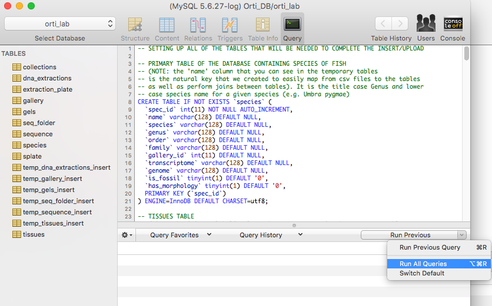
        - Validate that all of the tables and temporary tables have been created with the appropriate schemas.

And that is it! You are now completely set up with [Sequelpro](https://sequelpro.com) and MySQL.

## Data Insertion Instructions

#### Advisory!!!
**This section is useless if your data files (i.e. your csv files with the fish_life data are incorrect).  Also, this section is written in a particular order for a reason.  This is why we [RTFM](https://en.wikipedia.org/wiki/RTFM).**

### Insert data into Species Table  
   - First, open [sequelpro](https://sequelpro.com).
   - Next, locate the `.csv` file that you would like to upload to your database.
   - Once you have your file, in the top left-hand corner of the screen, navigate to `File >> Import...`
       - 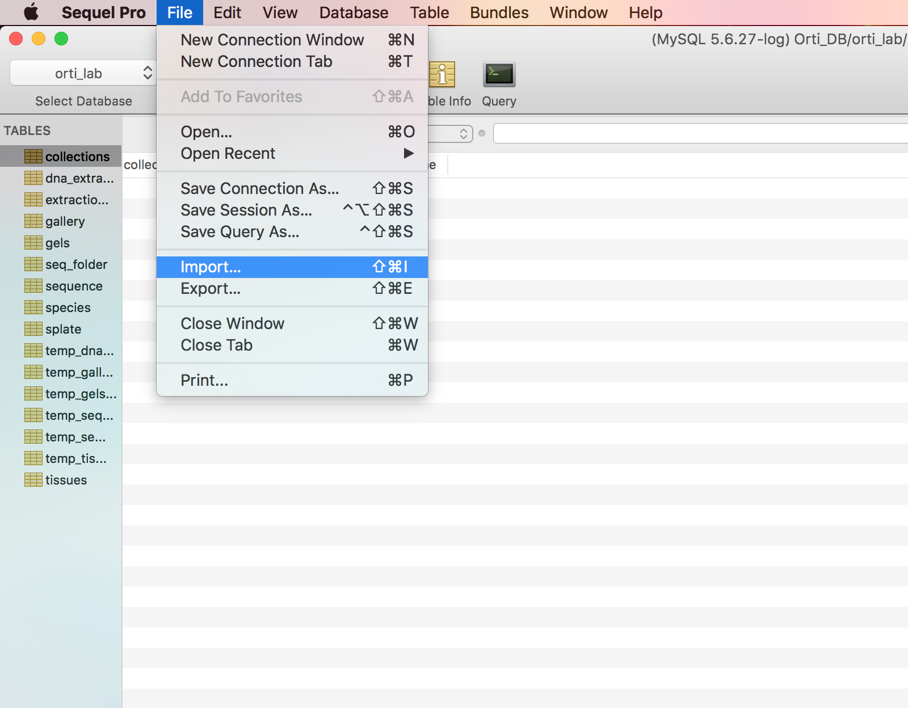
   - Now, select the correct table from the top drop-down menu
       - 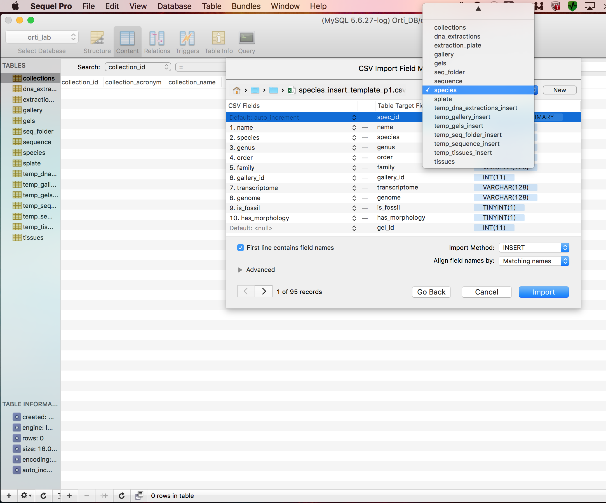
   - Now, configure your CSV mapping (i.e. which fields/columns you would like to import and which ones you would rather not).
       - 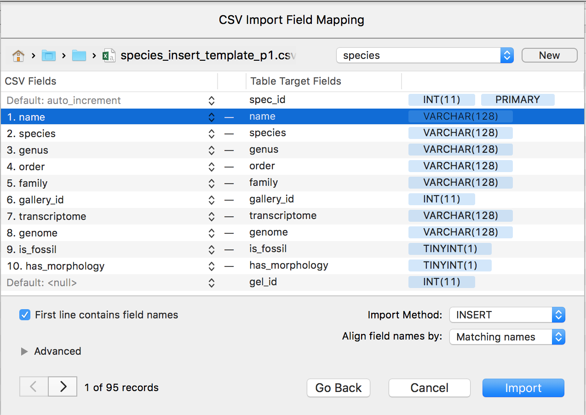
   - Click `Import` and Volila! You now have all your (new) data in the species table!
      - 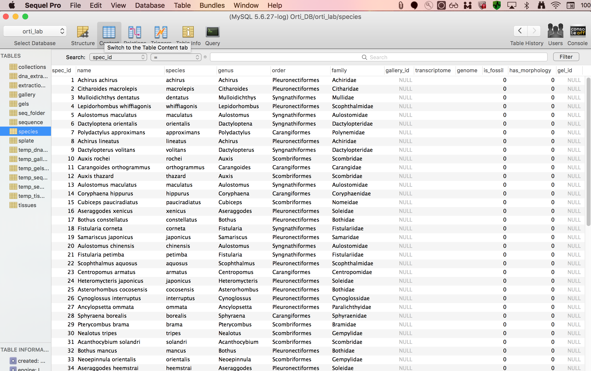

### Insert data into Collections Table
  - First, open [sequelpro](https://sequelpro.com).
  - Next, locate the `.csv` file that you would like to upload to your database.
  - Once you have your **Collections** file, in the top left-hand corner of the screen, navigate to `File >> Import...`
      - 
  - Now, select the correct table from the top drop-down menu
      - 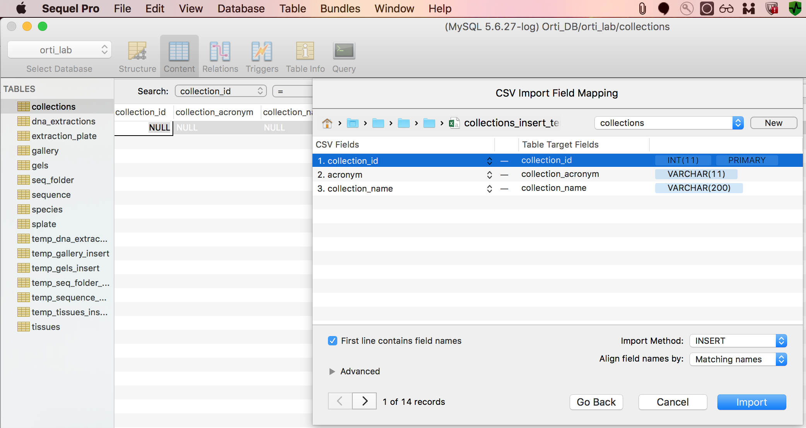
  - Now, because you do not want to set the `AUTO INCREMENTING` [primary key](https://www.w3schools.com/sql/sql_primarykey.asp) of `collection_id` to be set to `NULL` upon import, you need to ignore the `collection_id` field that exists in the insert template. by navigating to `1. collection_id >> Ignore Field`
      - 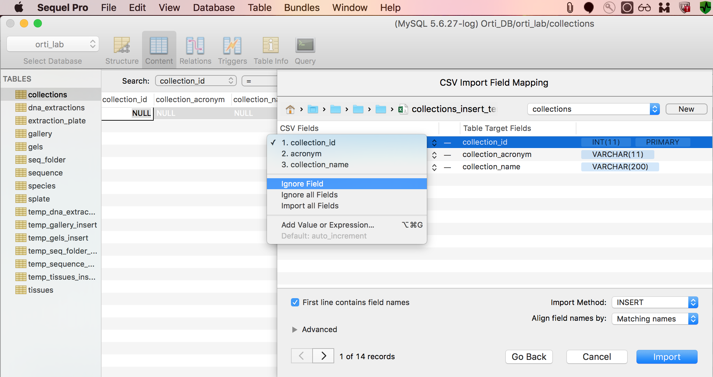
  - Now, you can see that we will only be importing the `collection_acronym` and `collection_name` fields/columns from the CSV file into the collections table.
      - 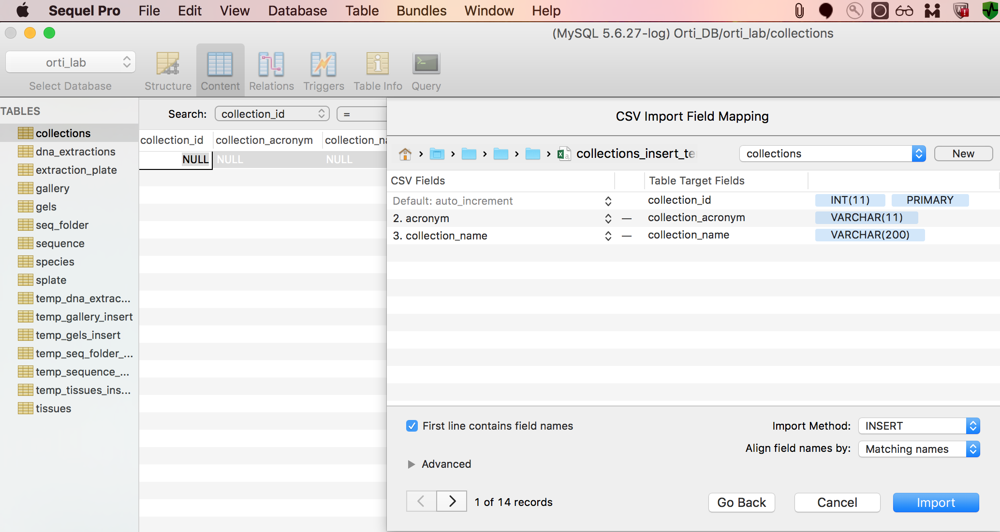
  - Click `Import` and Volila! You now have all your (new) data in the collections table!
     - 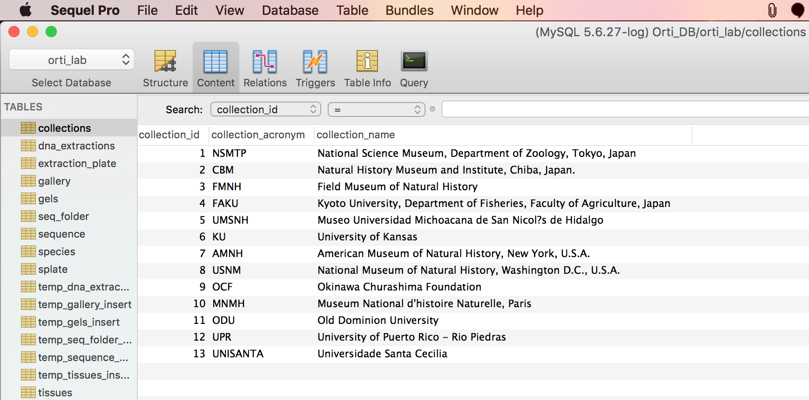

### Insert data into the temp_gallery_insert table
  - First, open [sequelpro](https://sequelpro.com).
  - Next, locate the `.csv` file that you would like to upload to your database.
  - Once you have your **temp_gallery_insert** file, in the top left-hand corner of the screen, navigate to `File >> Import...`
      - 
  - Now, select the correct table from the top drop-down menu
      - 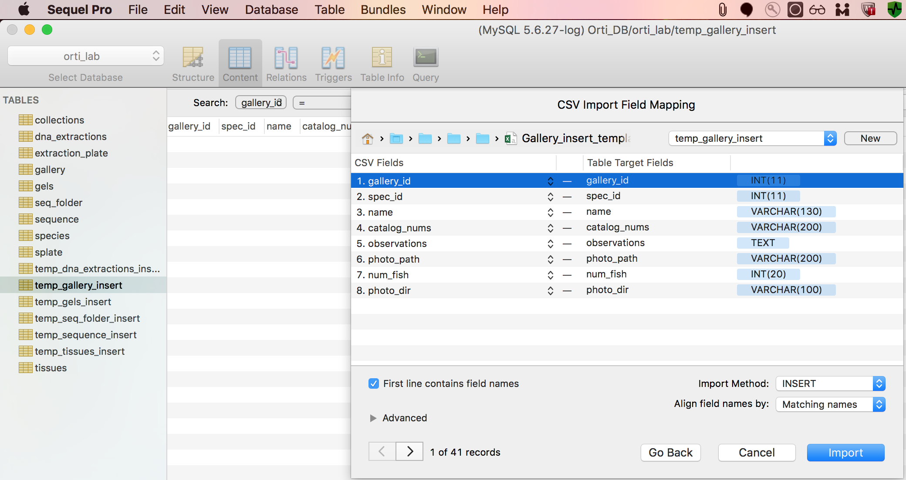
  - Now, because you do not want to set the `AUTO INCREMENTING` [primary key](https://www.w3schools.com/sql/sql_primarykey.asp) of `gallery_id` to be set to `NULL` upon import, you need to ignore the `collection_id` field that exists in the insert template. by navigating to `1. gallery_id >> Ignore Field`
      - 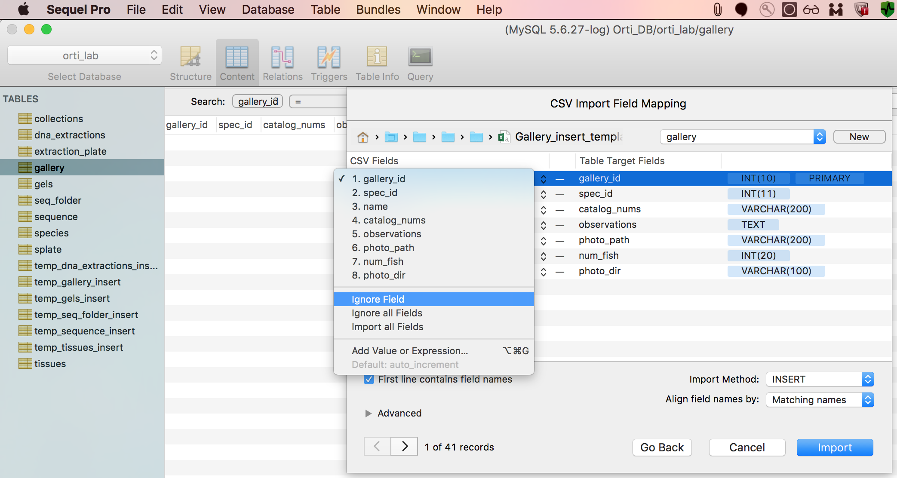
  - Again, because you do not want to set the [foreign key](https://en.wikipedia.org/wiki/Foreign_key) of `gallery_id` and `species_id` to be set to `NULL` you need to ignore the `collection_id` field that exists in the insert template. by navigating to `1. gallery_id >> Ignore Field`
      - 
  - Now, you can see that we will only be importing the `collection_acronym` and `collection_name` fields/columns from the CSV file into the collections table.
      - 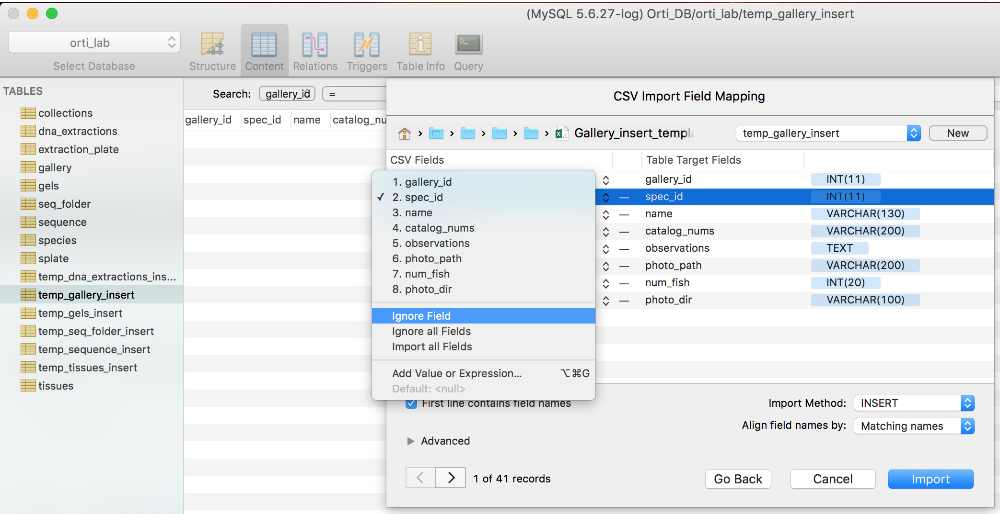
  - Click `Import` and Volila! You now have all your (new) data in the collections table!
     - 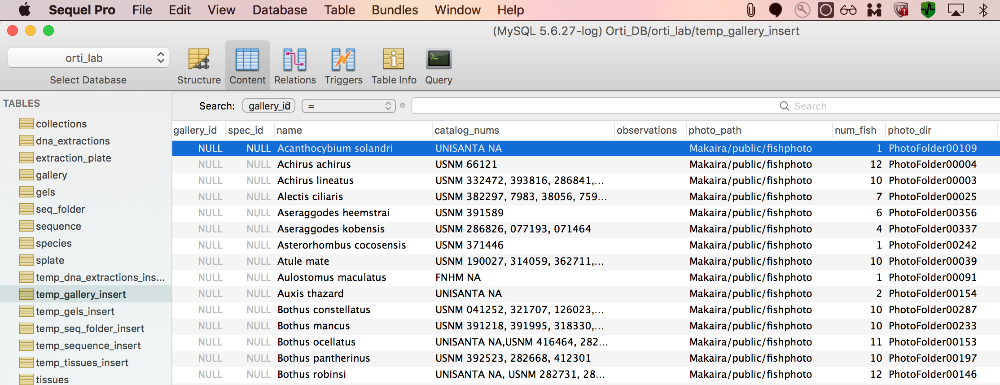

### Update unpopulated species_id data into the temp_gallery_insert table and correctly insert into final gallery table

### Insert data into the temp_tissues_insert table
